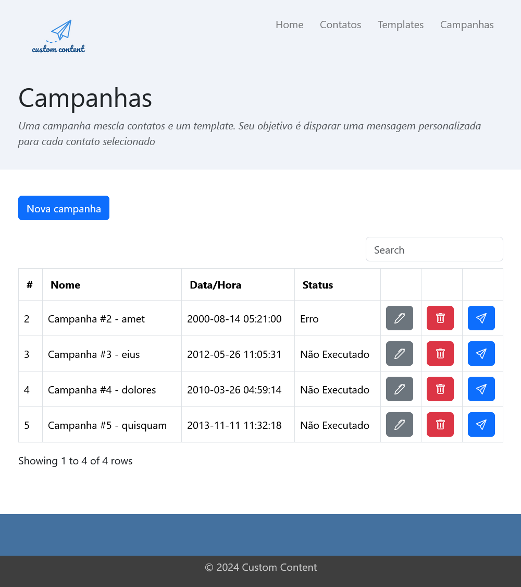

# Custom Content

## Índice

- [Sobre o projeto](#sobre-o-projeto)
- [Motivações](#motivações)
- [Status do projeto](#status-do-projeto)
- [Funcionalidades](#funcionalidades)
- [Telas do sistema](#telas-do-sistema)
- [Aprendizados](#aprendizados)
- [Tecnologias utilizadas](#tecnologias-utilizadas)
- [Pré-requisitos](#pré-requisitos)
- [Como instalar este projeto](#como-instalar-este-projeto)
- [Como usar este projeto](#como-usar-este-projeto)
- [Informações adicionais](#informações-adicionais)
    - [Lista de serviços SMTP gratuitos](#lista-de-serviços-smtp-gratuitos)
- [Licença](#licença)
- [Contribuidores](#contribuidores)

## Sobre o projeto

    

Custom Content é um projeto web para o envio (atualmente apenas por email) de mensagens personalizadas para contatos.

## Motivações

As motivações deste projeto são:
- Criar uma versão web apartir das experiências de uma aplicação em linha de comando que desenvolvi para envio de emails em lote.
- Estudar as funcionalidades do framework PHP CodeIgniter

## Status do projeto

Versão 0.1: Primeira versão funcional, é possível gerenciar contatos, templates e campanhas. Esta versão permite o envio de mensagens personalizadas. Como esta versão não possui ainda um sistema de login, a sugestão é executar este projeto em localhost e utilizar como um sistema monousuário.

## Funcionalidades

- Criar, editar e deletar contatos
- Criar, editar e deletar templates
- Criar, editar e deletar campanhas
- Execução de campanhas: realiza o envio de emails em lote

## Telas do sistema

## Aprendizados

- Funcionalidades do framework PHP CodeIgniter
- Padrão MVC
- MySQL e SQLite
- Migrations e Seeds
- Layouts com Bootstrap
- Testes unitários

## Tecnologias utilizadas

- [PHP](https://www.php.net/): Linguagem de programação
- [CodeIgniter](https://codeigniter.com/): Framework PHP
- [SQLite](https://www.sqlite.org/): Banco de dados relacional
- [MySQL](https://www.mysql.com/): Banco de dados relacional
- [Bootstrap](https://getbootstrap.com/): Framework web para desenvolvimento front-end

## Pré-requisitos

- [PHP](https://www.php.net/)
- [git](https://git-scm.com/)
- [Composer](https://getcomposer.org/)
- SQLite(embutido no PHP) ou [MySQL](https://www.mysql.com/)

## Como instalar este projeto

1. Garanta que o PHP, git, Composer e MySQL estejam instalados
    - para usar sqlite, habilite as suas extensões no php (arquivo php.ini), descomente as seguintes linhas:
	extension=pdo_sqlite
	extension=sqlite3

2. Clone o repositório: git clone https://github.com/edersontec/custom-content.git

3. Baixe as dependências: composer install

4. Prepare as variáveis de ambiente:
    - O arquivo *env.example* é um arquivo de exemplo para auxiliar na instalação da aplicação, basta preencher as informações
    - Renomeie o arquivo *env.example* para *.env*
    - Decida qual banco de dados irá usar: SQLite ou MySQL
        - SQLite: gere o arquivo de banco de dados utilizando o Spark (utilitário de linha de comando do CodeIgniter) e coloque na pasta /writable/db/
        php spark db:create data --ext sqlite
        php spark db:create tests --ext sqlite *ou defina ':memory:' para executar um banco de dados SQLite na memória*
        - MySQL: crie uma database, descomente as linhas, adicione as configurações do seu banco de dados MySQL e comente as linhas relacionadas as configurações do SQLite
    - Configure o serviço SMTP de envio dos emails
        - Utilize alguns [serviços SMTP gratuitos que testei](#lista-de-serviços-smtp-gratuitos) ou algum outro que deseje

5. Teste o serviço SMTP (a proposta é enviar um email de teste)
    cd custom-content
    php public\index.php testarenvioemail

6. Execute as Migrations (para criar as tabelas do banco de dados)
    cd custom-content
    php spark migrate

7. Execute a Seed AppDataSeeder (para popular o banco com dados predefinidos essenciais para o funcionamento da aplicação)
    cd custom-content
    php spark db:seed AppDataSeeder

8. (opcional) Execute a Seed TestSeeder (caso queira popular o banco com dados de exemplo)
    cd custom-content
    php spark db:seed TestSeeder

9. (opcional) Limpe os dados de exemplo
    cd custom-content
    php spark migrate:refresh

10. Execute a aplicação usando o servidor embutido do PHP
    cd custom-content
    php spark serve

## Como usar este projeto

1. Acesse a aplicação web em [http://localhost:8080](http://localhost:8080)
2. Acesse a página de contatos e crie um contato: Um contato é uma pessoa ou empresa com a qual você deseja enviar mensagens personalizadas.
3. Acesse a página de templates e crie um template: Um template é mensagem padronizada. É possível produzir mensagens personalizadas adicionando tags de contato.
4. Acesse a página de campanhas e crie uma campanha: Uma campanha mescla contatos e um template. Seu objetivo é disparar uma mensagem personalizada para cada contato selecionado.
5. Acesse a página de campanhas, escolha uma campanha criada e clique no botão de executar a campanha.
6. Sucesso! Campanha finalizada com sucesso.

## Informações adicionais

Logo gerado em [Free Logo Design](https://www.freelogodesign.org/)

### Lista de serviços SMTP gratuitos

Os serviços abaixo foram testados com sucesso. Estes estão pré-configurados nas variáveis de ambiente, basta criar uma conta e depois preencher os dados:

- [Brevo (ex Sendinblue)](https://www.brevo.com)
- [SAPO](https://mail.sapo.pt)

## Licença

Esse projeto está sob licença. Veja o arquivo [LICENÇA](LICENSE) para mais detalhes.

## Contribuidores

Sinta-se livre para para contribuir com o projeto

